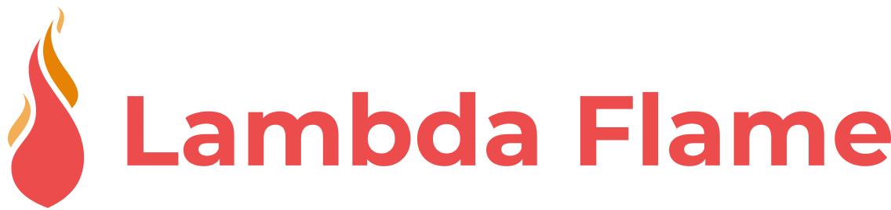
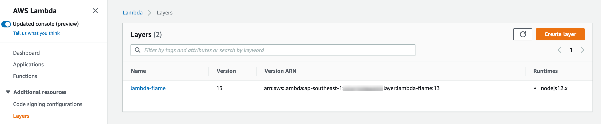
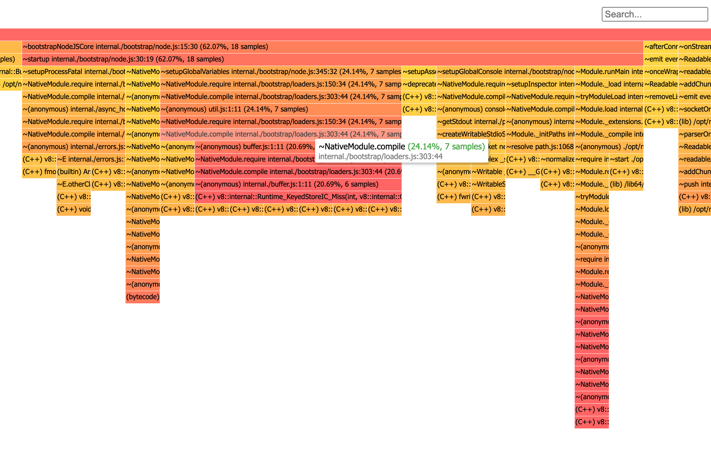

Extract flame graph for Nodejs directly from an AWS lambda function.
Lambda flame is a custom Nodejs runtime that collects and creates a flame graph of your lambda function process.

## Usage

### Deployment

The first thing is to deploy the Serverless application into your account.
You can do it via the AWS console: [lambda-flame](https://serverlessrepo.aws.amazon.com/applications/ap-southeast-1/164102481775/lambda-flame),
or directly into Cloudformation: (**make sure you specify the latest version**)
```yaml
  lambdaflame:
    Type: AWS::Serverless::Application
    Properties:
      Location:
        ApplicationId: arn:aws:serverlessrepo:ap-southeast-1:164102481775:applications/lambda-flame
        SemanticVersion: 1.0.0
```

### Setup
After the application has been deployed go to the lambda console, 
click on layers and copy the lambda-flame layer arn; 




#### SAM/Cloudformation
You can now paste the layer in your SAM/Cloudformation template:

```yaml
AWSTemplateFormatVersion: "2010-09-09"
Transform: "AWS::Serverless-2016-10-31"
Description: "Lambda flame test template"

Resources:
  ExampleFunction:
    Type: AWS::Serverless::Function
    Properties:
      Runtime: provided // Runtime must be set to provided
      Timeout: 30
      MemorySize: 1024
      CodeUri: ./
      Handler: handler.handler
      Environment:
        Variables:
          LAMBDA_FLAME_DEST_BUCKET: !Ref FlameBucket
          LAMBDA_FLAME_DEBUG: ALL
      Policies:
        - AWSLambdaBasicExecutionRole
        - S3WritePolicy: // Or simply s3:PutObject
            BucketName: !Ref FlameBucket
      Layers:
        - !Sub arn:aws:lambda:ap-southeast-1:{AWS::AccountId}:layer:lambda-flame:13 // Layer arn from the Lambda Flame application
      Events:
        HTTP:
          Type: Api
          Properties:
            Path: /
            Method: Get

  FlameBucket:
    Type: AWS::S3::Bucket
    Properties:
      BucketName: lambda-flame-graph-test

```

#### Serverless framework
Paste the arn in your `serverless.yaml`:

```yaml
service: lambda-flame-test-sls

provider:
  name: aws
  stackName: lambda-flame-test-sls
  region: ap-southeast-1
  iamRoleStatements:
    - Effect: Allow
      Action:
        - s3:PutObject
      Resource:
        - arn:aws:s3:::lambda-flame-graph-test
        - arn:aws:s3:::lambda-flame-graph-test/*

package:
  individually: true
        
functions:
  exampleFunction:
    memorySize: 1024
    timeout: 30
    handler: handler.handler
    runtime: provided
    environment:
      LAMBDA_FLAME_DEST_BUCKET: lambda-flame-graph-test
      LAMBDA_FLAME_DEBUG: ALL
    layers:
      - !Sub arn:aws:lambda:ap-southeast-1:${AWS::AccountId}:layer:lambda-flame:13
    events:
      - http:
          method: get
          path: /

resources:
  Resources:
    FlameBucket:
      Type: AWS::S3::Bucket
      Properties:
        BucketName: lambda-flame-graph-test

```

If you are using the **webpack plugin**, the custom runtime option will not work for versions < 5.4.0
Just add the `allowCustomRuntime: true` option to your function:

```yaml
  exampleFunction:
    handler: handler.handler
    runtime: provided
    allowCustomRuntime: true
    layers:
      - !Sub arn:aws:lambda:ap-southeast-1:${AWS::AccountId}:layer:lambda-flame:13
     ...
```

### Some important notes:

- The `Runtime` property **must be set to `provided`**
- All the result of the v8 profiling and the flamegraph creation will be sent to an S3 bucket of your choice. You **must specify a valid S3 Bucket name**. 
You can use any bucket you want and one bucket for all your functions, 
lambda flame will name space all the output files under `s3://<your-bucket-name>/lambda-flame/<function-name>/<epoch timestamp>/`
- In order to send the profiling output and flame graph files to your S3 bucket **make sure you have the required write permissions `s3:PutObject`** 
- The v8 profile output processing happens outside your handler invocation therefore it won't impact your function profiling. However, is a CPU bound operation, 
if you want to make it a bit faster just temporarily add more memory
- **This tool (for the time being) is not meant to run in a production environment, use it as a debugging purposes only**

### Run
After the invocation of your function has terminated, you can navigate to your S3 Bucket under `s3://<your-bucket-name>/lambda-flame/<function-name>/<epoch timestamp>/`
and open the `flamegraph.html`




## Config
You can set all the parameters via environmental variables

| Property | Type | Description | Default |
| -------- | ---- | ----------- | ------- |
| LAMBDA_FLAME_DEST_BUCKET | `String` | Valid S3 bucket name **required** | `undefined` |
| LAMBDA_FLAME_DEBUG | `String` | Activate debugging logs, they will appear in Cloudwatch, leave it empty if you don't want them | `ALL` |

## Roadmap
There are a lot of new features I want to add, feel free to contribute, open issues and share your ideas 🙏.

- Provide multiple runtimes other than nodejs (planning to support Go)
- Add more control over via configuration
- Automate builds of Nodejs runtimes
- Possibility to capture a heap dump
- Dramatically improve flame graph visualization and interactivity


## Notice
This tool (for the time being) is partially using a modified version [flamebearer](https://github.com/mapbox/flamebearer) all the credits goes to the [author](https://www.mapbox.com/) of this library.
In the future I am planning to build a custom visualization similar to [Clinic flame](https://clinicjs.org/flame/).
